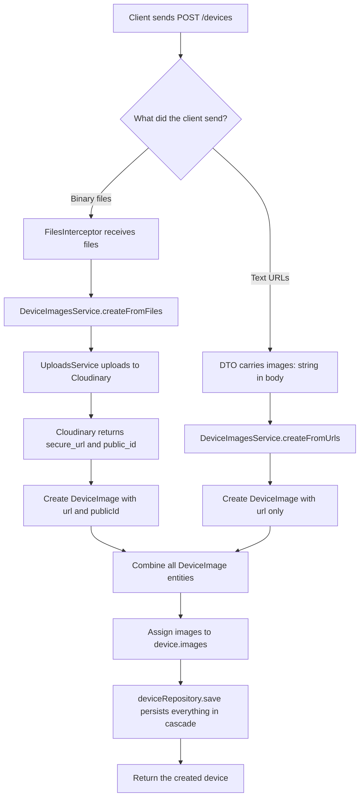
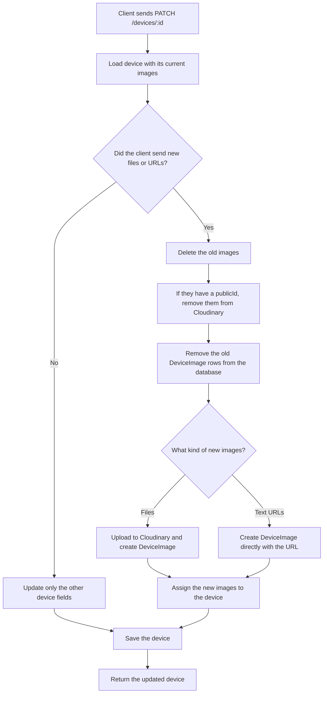
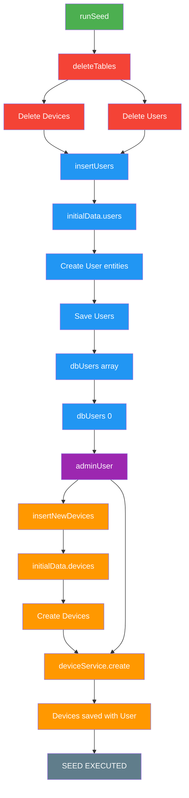

# Learning NestJS

Notas de aprendizaje del proyecto: setup inicial, base de datos, relaciones con TypeORM, y el módulo de imágenes de dispositivos con Cloudinary.

## Tabla de contenido

1. [Setup inicial del proyecto](#1-setup-inicial-del-proyecto)
2. [Base de datos con Docker](#2-base-de-datos-con-docker)
3. [TypeORM](#3-typeorm)
4. [Variables de entorno](#4-variables-de-entorno)
5. [Validadores](#5-validadores)
6. [Notas sueltas](#6-notas-sueltas)
7. [Relaciones en TypeORM](#7-relaciones-en-typeorm)
8. [Aplanar relaciones en la respuesta](#8-aplanar-relaciones-en-la-respuesta)
9. [Archivos y uploads](#9-archivos-y-uploads)
10. [Módulo de imágenes de dispositivos (Cloudinary)](#10-módulo-de-imágenes-de-dispositivos-cloudinary)
11. [Referencias](#11-referencias)

---

## 1. Setup inicial del proyecto

Una vez creado el proyecto, desinstalar Prettier:

```bash
npm uninstall prettier eslint-plugin-prettier eslint-config-prettier
```

---

## 2. Base de datos con Docker

### 2.1 `docker-compose.yaml`

Define el servicio de PostgreSQL en el `docker-compose.yaml` del proyecto.

### 2.2 Levantar la base de datos

```bash
docker-compose up -d
```

---

## 3. TypeORM

### 3.1 Instalación

```bash
npm install --save @nestjs/typeorm typeorm pg
```

### 3.2 Levantar la base de datos

```bash
docker-compose up -d
```

---

## 4. Variables de entorno

### 4.1 Instalación

```bash
npm install @nestjs/config
```

### 4.2 Configuración en `app.module.ts`

```typescript
ConfigModule.forRoot();
```

> Recuerda agregar `.env` a `.gitignore`.

---

## 5. Validadores

### 5.1 Instalación

```bash
npm i class-validator class-transformer
npm i uuid
```

---

## 6. Notas sueltas

- **MongoDB**: si usas Mongo, el `id` lo genera Mongo automáticamente, no es necesario declararlo. La entidad debe extender `Document` y usar el decorador `@Schema`. El esquema se exporta con `SchemaFactory.createForClass(...)`.
- Recuerda siempre registrar los módulos nuevos en los `imports` del módulo padre.

---

## 7. Relaciones en TypeORM

En NestJS usando TypeORM, la relación **1 a N** se define con los decoradores `@OneToMany` (en el lado 1) y `@ManyToOne` (en el lado N).

Por convención, el lado **N** es el que guarda la clave foránea en la tabla de la base de datos, y TypeORM genera el nombre de la columna automáticamente combinando el nombre de la propiedad + el nombre de la columna clave primaria.

### 7.1 Ejemplo práctico: un `User` tiene muchas `Photo`s (1 a N)

**Lado N** — la entidad que contiene la clave foránea (`Photo`). Se usa `@ManyToOne` para definir la relación y `@JoinColumn()` si quieres personalizar el nombre físico de la columna:

```typescript
import {
  Entity,
  PrimaryGeneratedColumn,
  Column,
  ManyToOne,
  JoinColumn,
} from 'typeorm';
import { User } from './user.entity';

@Entity('photos')
export class Photo {
  @PrimaryGeneratedColumn()
  id: number;

  @Column()
  url: string;

  @ManyToOne(() => User, (user) => user.photos)
  @JoinColumn({ name: 'user_id' }) // opcional: nombre exacto de la columna FK
  user: User;
}
```

**Lado 1** — no genera ninguna columna física en la tabla `users`, usa `@OneToMany` apuntando a la propiedad del lado N:

```typescript
import { Entity, PrimaryGeneratedColumn, Column, OneToMany } from 'typeorm';
import { Photo } from './photo.entity';

@Entity('users')
export class User {
  @PrimaryGeneratedColumn()
  id: number;

  @Column()
  name: string;

  @OneToMany(() => Photo, (photo) => photo.user)
  photos: Photo[];
}
```

### 7.2 Reglas de nombramiento para la clave foránea (FK)

| Configuración                          | Nombre de la columna en la BD | Explicación                                                     |
| -------------------------------------- | ----------------------------- | --------------------------------------------------------------- |
| Por defecto (sin `@JoinColumn`)        | `userId`                      | Genera `propiedad` + `Id` en formato camelCase.                 |
| Con `@JoinColumn({ name: 'user_id' })` | `user_id`                     | Fuerza el nombre a snake_case (recomendado para PostgreSQL).    |
| Con la propiedad explícita del ID      | `userId` / `user_id`          | Permite acceder directamente al ID sin cargar toda la relación. |

### 7.3 Mapeo explícito del ID de la relación (recomendado)

En proyectos reales es muy común querer acceder directamente al ID de la relación sin cargar toda la entidad relacional. Para eso, defines tanto la columna del ID como la propiedad relacional:

```typescript
@Entity('photos')
export class Photo {
  @PrimaryGeneratedColumn()
  id: number;

  // Propiedad para acceder al valor del ID directamente
  @Column({ name: 'user_id' })
  userId: number;

  // Objeto de relación
  @ManyToOne(() => User, (user) => user.photos, { onDelete: 'CASCADE' })
  @JoinColumn({ name: 'user_id' }) // debe coincidir con el name de @Column
  user: User;
}
```

Con esto:

- `photo.userId` devuelve el número del ID (ej. `5`).
- `photo.user` devuelve el objeto completo de `User` (si cargaste `relations: ['user']`).

---

## 8. Aplanar relaciones en la respuesta

Cuando quieres devolver solo las URLs en vez del arreglo completo de objetos relacionados, usa `@Transform` de `class-transformer`:

```typescript
import { Transform } from 'class-transformer';

export class ProductResponseDto {
  id: number;
  name: string;

  // Transforma el arreglo de objetos ProductImage[] a string[]
  @Transform(({ value }) => value?.map((img: { url: string }) => img.url) || [])
  images: string[];
}
```

> Nota: una query runner puede ejecutar varias queries en una sola transacción.

---

## 9. Archivos y uploads

### 9.1 Tipos para Multer

```bash
npm i -D @types/multer
```

En `tsconfig.json`, para que `Express.Multer.File` sea reconocido:

```json
"types": ["node", "express", "multer"]
```

```bash
npm install uuid
```

### 9.2 Subida de archivos con Cloudinary

```bash
npm install cloudinary streamifier
npm install --save-dev @types/multer
```

---

## 10. Módulo de imágenes de dispositivos (Cloudinary)

El módulo `devices` soporta dos orígenes distintos de imágenes para un mismo dispositivo:

- **Archivos binarios** subidos por el usuario vía `multipart/form-data` → se suben a Cloudinary.
- **URLs de texto plano** ya existentes (por ejemplo, imágenes servidas desde una carpeta pública o importadas de otro sistema) → se guardan directamente, sin pasar por Cloudinary.

Ambos orígenes terminan creando una entidad `DeviceImage`, que luego se asocia al `Device`.

### 10.1 Crear un dispositivo (`POST /devices`)

El siguiente diagrama muestra cómo se combinan ambos orígenes de imágenes al crear un dispositivo:



### 10.2 Actualizar un dispositivo (`PATCH /devices/:id`)

Al actualizar, si el cliente envía archivos o URLs nuevas, las imágenes anteriores se eliminan por completo (de Cloudinary y de la base de datos) antes de guardar las nuevas:



### 10.3 Responsabilidades por archivo

| Archivo                    | Responsabilidad                                                                                                       |
| -------------------------- | --------------------------------------------------------------------------------------------------------------------- |
| `devices.controller.ts`    | Recibe el DTO y los archivos (multipart), delega todo al service.                                                     |
| `devices.service.ts`       | Orquesta la creación/actualización del `Device`, sin saber los detalles de Cloudinary.                                |
| `device-images.service.ts` | Sabe construir `DeviceImage` desde archivos (`createFromFiles`) o desde URLs (`createFromUrls`), y también borrarlas. |
| `uploads.service.ts`       | Único punto que habla directamente con la API de Cloudinary (subir y borrar).                                         |

---



## 12. Dcoumetacion

`npm install --save @nestjs/swagger`

## 11. Referencias

- [Documentación de TypeORM](https://orkhan.gitbook.io/typeorm)
