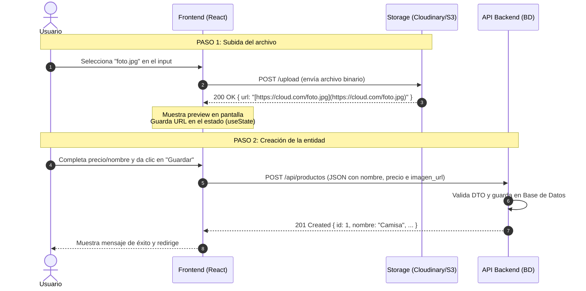

# Documentación del Proyecto y Arquitectura de Datos

## 1. Modelo Entidad-Relación (ERD)

```mermaid
erDiagram
    USER {
        UUID id PK
        TEXT email UK
        TEXT password
        TEXT fullName
        BOOLEAN isActive
        string_array roles
    }

    DEVICE {
        UUID id PK
        TEXT modelName UK
        FLOAT price
        TEXT technicalDetails
        TEXT modelSlug UK
        INT unitsInStock
        string_array availableColor
        TEXT targetMarket
        string_array accessoriesIncluded
        UUID userId FK
        UUID categoryId FK
    }

    DEVICEIMAGE {
        INT id PK
        TEXT url
        TEXT publicId
        UUID deviceId FK
    }

    ORDER {
        UUID id PK
        DATETIME orderDate
        DECIMAL totalAmount
        TEXT status
        TEXT shippingAddress
        UUID userId FK
    }

    ORDERITEM {
        UUID id PK
        INT quantity
        DECIMAL unitPrice
        TEXT selectedColor
        UUID orderId FK
        UUID deviceId FK
    }

    PAYMENT {
        UUID id PK
        TEXT paymentMethod
        DATETIME paymentDate
        DECIMAL amount
        TEXT status
        TEXT transactionId UK
        TEXT currency
        UUID orderId FK
    }

    CATEGORY {
        UUID id PK
        TEXT name UK
        TEXT description
        DATETIME createdAt
        DATETIME updatedAt
    }

    %% Relaciones con cardinalidades numéricas
    USER ||--o{ DEVICE : "1 a 0..N"
    USER ||--o{ ORDER : "1 a 0..N"
    DEVICE ||--o{ DEVICEIMAGE : "1 a 0..N"
    ORDER ||--|{ ORDERITEM : "1 a 1..N"
    DEVICE ||--o{ ORDERITEM : "1 a 0..N"
    ORDER ||--|| PAYMENT : "1 a 1"
    CATEGORY ||--o{ DEVICE : "1 a 0..N"
```



---

## 2. Definición del Campo `targetMarket`

Define el segmento comercial o gama del dispositivo:

* **`budget` (Gama de entrada / Económico):** Productos accesibles, de bajo costo, enfocados en funciones básicas.
* **`mid-range` (Gama media):** Balance entre costo y rendimiento; buena calidad a precio moderado.
* **`premium` (Gama alta):** Productos de costo elevado, mejores materiales y características superiores.
* **`flagship` (Gama insignia / Top de línea):** El producto estrella de la marca; tecnología más avanzada de la categoría (ejemplo: Samsung Ultra, iPhone Pro Max).

---

## 3. Mapeo de Respuesta (Transformación de Imágenes)

Función para aplanar la relación de imágenes a un arreglo de URLs simples en la respuesta del Backend:

```javascript
return devices.map(({ images, ...product }) => ({
  ...product,
  images: images?.map((img) => img.url) ?? [],
}));
```

---

## 4. Diagrama de Secuencia: Carga Desacoplada de Archivos

