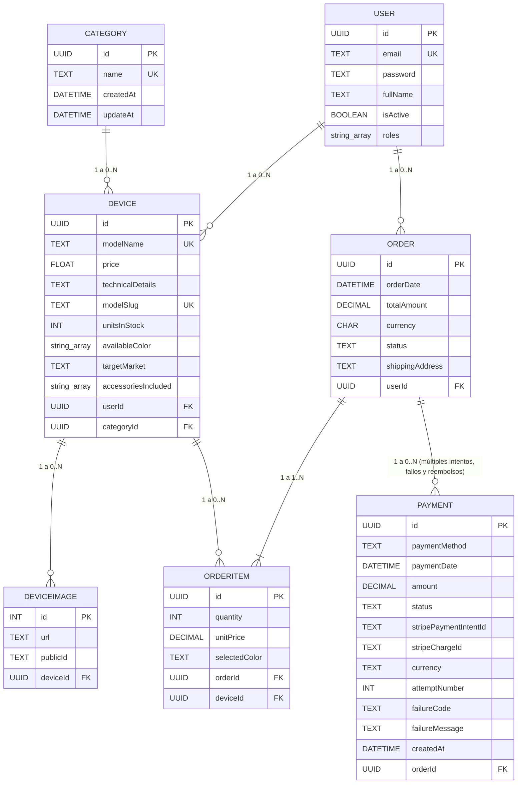
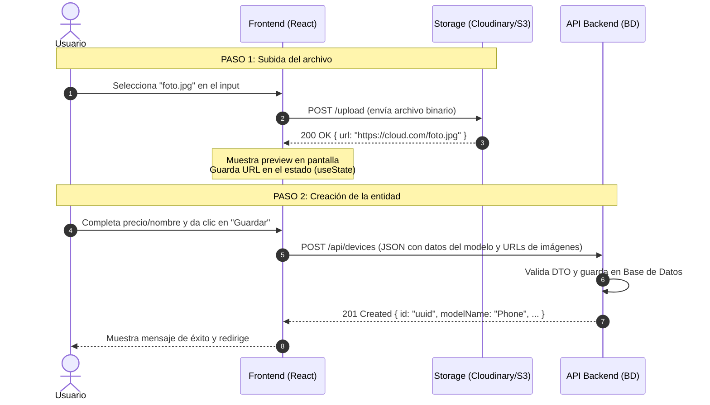

# Documentación de Datos de MobiStore

Este documento describe las entidades principales, sus campos, relaciones y reglas de negocio. Los nombres de tablas y campos siguen el código TypeORM del proyecto.

## Resumen del modelo

- `User` es dueño de sus devices y órdenes.
- `Category` agrupa los devices.
- `Device` guarda el precio actual del catálogo.
- `Order` guarda la compra del cliente.
- `OrderItem` guarda cada device incluido en una orden.
- `Payment` guarda cada intento de pago de una orden.
- `DeviceImage` guarda las imágenes de un device.

## 1. Modelo Entidad-Relación (ERD)



---

## 2. Reglas de precios y órdenes

### `Device.price`

`Device.price` es el precio actual mostrado en el catálogo. Puede cambiar cuando la tienda actualiza un device.

### `OrderItem.unitPrice`

`OrderItem.unitPrice` es una copia de `Device.price` en el momento de la compra. No debe cambiar cuando cambie el precio del catálogo.

El backend debe leer el precio desde `Device` al crear un item. El cliente no debe elegir este valor.

El subtotal del item se calcula así:

`quantity * unitPrice`

El total de la orden es la suma de todos los subtotales. `totalAmount` debe calcularlo el backend.

### Creating an order with several devices

Una orden puede contener muchos items. Cada item apunta a un device:

| orderId | deviceId | quantity | selectedColor | unitPrice |
| ------- | -------- | -------- | ------------- | --------- |
| Order A | Device 1 | 1        | Black         | 2499.99   |
| Order A | Device 2 | 2        | Blue          | 899.99    |

El mismo `orderId` puede aparecer en varias filas porque todas pertenecen a la misma orden.

## 3. Definición del campo `targetMarket`

Define el segmento comercial o gama del dispositivo:

- **`budget` (Gama de entrada / Económico):** Productos accesibles, de bajo costo, enfocados en funciones básicas.
- **`mid-range` (Gama media):** Balance entre costo y rendimiento; buena calidad a precio moderado.
- **`premium` (Gama alta):** Productos de costo elevado, mejores materiales y características superiores.
- **`flagship` (Gama insignia / Top de línea):** El producto estrella de la marca; tecnología más avanzada de la categoría (ejemplo: Samsung Ultra, iPhone Pro Max).

---

## 4. Mapeo de respuesta de imágenes

Función para aplanar la relación de imágenes a un arreglo de URLs simples en la respuesta del Backend:

```javascript
return devices.map(({ images, ...product }) => ({
  ...product,
  images: images?.map((img) => img.url) ?? [],
}));
```

---

## 5. Diccionario de atributos: DEVICE

| Atributo              | Tipo      | Significado                                              |
| --------------------- | --------- | -------------------------------------------------------- |
| `id`                  | UUID (PK) | Identificador único del device.                          |
| `modelName`           | TEXT (UK) | Nombre del modelo.                                       |
| `price`               | FLOAT     | Precio actual del catálogo.                              |
| `technicalDetails`    | TEXT      | Detalles técnicos opcionales.                            |
| `modelSlug`           | TEXT (UK) | Nombre usado en URLs.                                    |
| `unitsInStock`        | INT       | Cantidad disponible.                                     |
| `availableColor`      | TEXT[]    | Colores disponibles.                                     |
| `targetMarket`        | TEXT      | Segmento: `budget`, `mid-range`, `premium` o `flagship`. |
| `accessoriesIncluded` | TEXT[]    | Accesorios incluidos.                                    |
| `userId`              | UUID (FK) | Usuario que creó o actualizó el device.                  |
| `categoryId`          | UUID (FK) | Categoría del device.                                    |

## 6. Diccionario de atributos: DEVICEIMAGE

| Atributo   | Tipo      | Significado                                       |
| ---------- | --------- | ------------------------------------------------- |
| `id`       | INT (PK)  | Identificador único de la imagen.                 |
| `url`      | TEXT      | URL pública de la imagen.                         |
| `publicId` | TEXT      | Identificador opcional del archivo en Cloudinary. |
| `deviceId` | UUID (FK) | Device al que pertenece la imagen.                |

## 7. Diccionario de atributos: ORDER

| Atributo          | Tipo          | Significado                                          |
| ----------------- | ------------- | ---------------------------------------------------- |
| `id`              | UUID (PK)     | Identificador único de la orden.                     |
| `orderDate`       | DATETIME      | Fecha y hora de creación.                            |
| `totalAmount`     | DECIMAL(10,2) | Suma de los subtotales de la orden.                  |
| `currency`        | CHAR(3)       | Moneda ISO 4217, por ejemplo `USD` o `COP`.          |
| `status`          | ENUM          | Estado actual: `PENDING`, `CONFIRMED` o `CANCELLED`. |
| `shippingAddress` | TEXT          | Dirección de entrega.                                |
| `userId`          | UUID (FK)     | Usuario dueño de la orden.                           |

## 8. Diccionario de atributos: ORDERITEM

| Atributo        | Tipo          | Significado                               |
| --------------- | ------------- | ----------------------------------------- |
| `id`            | UUID (PK)     | Identificador único de la línea.          |
| `quantity`      | INT           | Cantidad del device comprado.             |
| `unitPrice`     | DECIMAL(10,2) | Precio histórico del device en la compra. |
| `selectedColor` | TEXT          | Color elegido por el cliente.             |
| `orderId`       | UUID (FK)     | Orden a la que pertenece la línea.        |
| `deviceId`      | UUID (FK)     | Device comprado.                          |

## 9. Diccionario de atributos: PAYMENT

| Atributo                | Tipo      | Significado                                                                                                                                        |
| ----------------------- | --------- | -------------------------------------------------------------------------------------------------------------------------------------------------- |
| `id`                    | UUID (PK) | Identificador único de esta fila/intento de pago en tu base de datos.                                                                              |
| `paymentMethod`         | TEXT      | Método usado para pagar (ej. `card`, `oxxo`, `transfer`, según lo que soporte Stripe en tu integración).                                           |
| `paymentDate`           | DATETIME  | Fecha y hora en que el pago se confirmó como exitoso. Queda vacío/null si el intento falló.                                                        |
| `amount`                | DECIMAL   | Monto cobrado (o a cobrar) en este intento específico.                                                                                             |
| `status`                | ENUM      | Estado real: `PENDING`, `SUCCEEDED`, `FAILED`, `CANCELED` o `REFUNDED`.                                                                            |
| `stripePaymentIntentId` | TEXT (UK) | ID único del `PaymentIntent` de Stripe (`pi_...`). Identifica el proceso de cobro de una orden.                                                    |
| `stripeChargeId`        | TEXT      | ID del `Charge` de Stripe (`ch_...`). Es único por cada intento real de cobro, incluso si el `PaymentIntent` es el mismo.                          |
| `currency`              | TEXT      | Moneda del cobro (ej. `COP`, `USD`), en formato ISO 4217.                                                                                          |
| `attemptNumber`         | INT       | Número de intento para esa orden (1, 2, 3...), útil para mostrar historial sin contar filas.                                                       |
| `failureCode`           | TEXT      | Código de error que devuelve Stripe cuando el pago falla (ej. `card_declined`, `insufficient_funds`, `expired_card`). Null si el pago fue exitoso. |
| `failureMessage`        | TEXT      | Mensaje legible para humanos que explica por qué falló el pago. Null si fue exitoso.                                                               |
| `createdAt`             | DATETIME  | Fecha y hora en que se creó el registro del intento, sin importar si tuvo éxito o no.                                                              |
| `orderId`               | UUID (FK) | Referencia a la orden a la que pertenece este intento de pago.                                                                                     |

---

## 10. Diccionario de atributos: CATEGORY

| Atributo    | Tipo      | Significado                                            |
| ----------- | --------- | ------------------------------------------------------ |
| `id`        | UUID (PK) | Identificador único de la categoría.                   |
| `name`      | TEXT (UK) | Nombre único de la categoría. Se guarda en minúsculas. |
| `createdAt` | DATETIME  | Fecha de creación.                                     |
| `updateAt`  | DATETIME  | Fecha de la última actualización.                      |

## 11. Flujo de carga de imágenes



## 12. Estados permitidos

| Entity           | Values                                                   |
| ---------------- | -------------------------------------------------------- |
| `Order.status`   | `PENDING`, `CONFIRMED`, `CANCELLED`                      |
| `Payment.status` | `PENDING`, `SUCCEEDED`, `FAILED`, `CANCELED`, `REFUNDED` |

Los estados deben coincidir con los valores enum usados por TypeORM. No uses `PAID`, `PROCESSING`, `SHIPPED` o `DELIVERED` hasta agregarlos a la entidad.

## 13. DTOs y validación

Los DTOs validan los datos antes de guardarlos en la base de datos. Validan UUIDs, números positivos, fechas, códigos de moneda, estados y items anidados.

Cuando una orden contiene varios devices, `CreateOrderWithDevidesDto` recibe un arreglo `orderItems`. Cada item contiene `deviceId`, `quantity` y `selectedColor`. El backend crea primero la orden, después crea una fila `OrderItem` por device y asigna el `unitPrice` histórico.

## 14. Nota de actualización de la base de datos

La base de datos debe incluir la columna `unitPrice` en `orderItems`. Si la sincronización está desactivada, crea y ejecuta una migración antes de usar el nuevo modelo.
