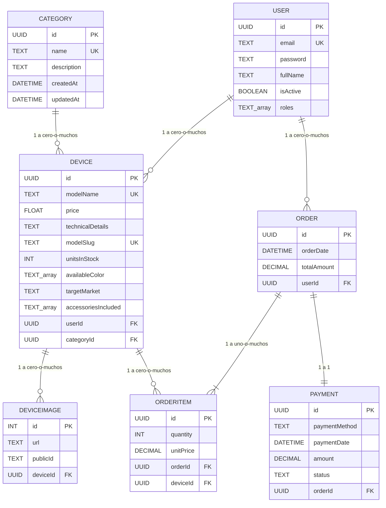

¿Qué significa cada valor en este contexto?

En el contexto de tu aplicación (como un e-commerce o catálogo de dispositivos), define la gama o segmento de mercado al que está destinado un producto:

    budget (Gama de entrada / Económico): Productos accesibles, de bajo costo, enfocados en funcionalidades básicas.

    mid-range (Gama media): Productos con balance entre costo y rendimiento; buena calidad a un precio moderado.

    premium (Gama alta): Productos de costo elevado, mejores materiales, mejores características y diseño superior.

    flagship (Gama insignia / Top de línea): El producto estrella de la marca; lo más avanzado en tecnología y el más costoso (ejemplo: Samsung Ultra, iPhone Pro Max).

    return devices.map(({ images, ...product }) => ({

...product,
images: images?.map((img) => img.url) ?? [],
}));
