# Diccionario de Datos — app-mobistore

Catálogo de Dispositivos Móviles. Documento de práctica (nivel junior/mid), no busca ser exhaustivo.

---

## 1. Entidad: `Device`

Representa un modelo de celular publicado en el catálogo.

| Atributo              | Tipo      | Descripción                                                                                                                                  | Ejemplo                                                                |
| --------------------- | --------- | -------------------------------------------------------------------------------------------------------------------------------------------- | ---------------------------------------------------------------------- |
| `id`                  | UUID (PK) | Identificador único del dispositivo.                                                                                                         | `a1b2c3d4-e5f6-4a1b-9c2d-1234567890ab`                                 |
| `modelName`           | string    | Nombre comercial del modelo, tal como se muestra al cliente.                                                                                 | `"Samsung Galaxy S24 Ultra"`                                           |
| `price`               | float     | Precio de venta del dispositivo (moneda base del sistema).                                                                                   | `1299.99`                                                              |
| `technicalDetails`    | string    | Ficha técnica en texto libre: RAM, almacenamiento, cámara, procesador, batería, etc.                                                         | `"12GB RAM, 256GB, Snapdragon 8 Gen 3, cámara 200MP, batería 5000mAh"` |
| `modelSlug`           | string    | Versión "amigable para URL" del nombre del modelo, en minúsculas y sin espacios. Se usa para rutas como `/devices/samsung-galaxy-s24-ultra`. | `"samsung-galaxy-s24-ultra"`                                           |
| `unitsInStock`        | int       | Cantidad de unidades disponibles en inventario.                                                                                              | `15`                                                                   |
| `availableColors`     | string[]  | Lista de colores en los que existe el modelo.                                                                                                | `["Titanium Black", "Titanium Gray", "Titanium Violet"]`               |
| `targetMarket`        | string    | Segmento o región de mercado al que va dirigido el dispositivo (útil para filtros o campañas).                                               | `"gama-alta"` (u otras: `"gama-media"`, `"latam"`, `"global"`)         |
| `accessoriesIncluded` | string[]  | Accesorios que vienen incluidos en la caja al comprar el dispositivo.                                                                        | `["cargador", "cable USB-C", "audífonos", "protector de pantalla"]`    |

> **Nota sobre `targetMarket`:** suele ser un valor más controlado (categoría de negocio). En una versión más formal, `targetMarket` podría convertirse en un `enum` o en una tabla de catálogo (`MarketSegment`).
>
> Las etiquetas de búsqueda/filtrado (antes `tags: string[]`) ahora viven como entidad separada — ver `Tag` en la sección 4.4, relacionada con `Device` mediante N a N.

---

## 2. Entidad: `DeviceImage`

Imágenes asociadas a un dispositivo (galería de fotos del producto).

| Atributo   | Tipo                    | Descripción                                                                                   | Ejemplo                                                   |
| ---------- | ----------------------- | --------------------------------------------------------------------------------------------- | --------------------------------------------------------- |
| `id`       | int (PK)                | Identificador de la imagen.                                                                   | `101`                                                     |
| `url`      | text                    | Dirección donde está almacenada la imagen (puede ser una URL externa o de un bucket/storage). | `"https://cdn.mobistore.com/devices/s24-ultra/front.jpg"` |
| `deviceId` | UUID (FK → `Device.id`) | Dispositivo al que pertenece la imagen.                                                       | `a1b2c3d4-e5f6-4a1b-9c2d-1234567890ab`                    |

**Relación:** `Device (1) ── contiene ──> (0..*) DeviceImage`
Un dispositivo puede tener cero o varias imágenes; si se borra el `Device`, sus imágenes se borran también (`onDelete: CASCADE`).

---

## 3. Entidad: `User`

Usuario del sistema (quien publica/administra dispositivos).

| Atributo   | Tipo                         | Descripción                                                                                                                                                            | Ejemplo                                          |
| ---------- | ---------------------------- | ---------------------------------------------------------------------------------------------------------------------------------------------------------------------- | ------------------------------------------------ |
| `id`       | UUID (PK)                    | Identificador único del usuario.                                                                                                                                       | `f9e8d7c6-b5a4-4321-9876-abcdef123456`           |
| `email`    | text `«unique»`              | Correo del usuario, usado para login. No se puede repetir.                                                                                                             | `"admin@mobistore.com"`                          |
| `password` | text `«select: false»`       | Contraseña (hasheada). El modificador `select: false` indica que no se trae por defecto en las consultas normales, solo cuando se necesita explícitamente (ej. login). | `"$2b$10$abcd1234..."` (hash, nunca texto plano) |
| `fullName` | text                         | Nombre completo del usuario.                                                                                                                                           | `"Laura Gómez"`                                  |
| `isActive` | boolean `«default: true»`    | Indica si la cuenta está activa. Permite desactivar sin borrar (soft delete).                                                                                          | `true`                                           |
| `roles`    | text[] `«default: ['user']»` | Lista de roles del usuario dentro del sistema.                                                                                                                         | `["user"]` o `["admin", "user"]`                 |

**Relación:** `Device (N) ── publicado por ──> (1) User`
Cada dispositivo fue publicado por un único usuario; un usuario puede publicar muchos dispositivos.

---

## 4. Propuesta: otras tablas para el negocio (opcional / a futuro)

Estas tablas **no están implementadas todavía** — son una propuesta para practicar distintos tipos de relación (1 a N, 1 a 1, N a N con atributos propios, y N a N sin atributos). No incluye lista de deseos ni carrito de compras.

### 4.1 `Category` — relación 1 a N

Categoriza los dispositivos (celulares, tablets, accesorios, etc.), en vez de manejarlo solo con `tags`.

| Atributo      | Tipo      | Descripción                    | Ejemplo                                       |
| ------------- | --------- | ------------------------------ | --------------------------------------------- |
| `id`          | UUID (PK) | Identificador de la categoría. | `...`                                         |
| `name`        | text      | Nombre de la categoría.        | `"Smartphones"`                               |
| `description` | text?     | Descripción corta.             | `"Teléfonos inteligentes de todas las gamas"` |

**Relación:** `Category (1) ──> (N) Device`

### 4.2 `Warranty` — relación 1 a 1

Datos de garantía de un dispositivo específico. Cada dispositivo tiene **una sola** garantía asociada, y esa garantía pertenece a un único dispositivo (por eso es 1 a 1 y no 1 a N).

| Atributo         | Tipo                               | Descripción                                                                                                                  | Ejemplo                                          |
| ---------------- | ---------------------------------- | ---------------------------------------------------------------------------------------------------------------------------- | ------------------------------------------------ |
| `id`             | UUID (PK)                          | Identificador de la garantía.                                                                                                | `...`                                            |
| `deviceId`       | UUID (FK → `Device.id`) `«unique»` | Dispositivo al que pertenece. El `unique` en la FK es lo que fuerza el 1 a 1 (evita que un dispositivo tenga dos garantías). | `...`                                            |
| `durationMonths` | int                                | Duración de la garantía en meses.                                                                                            | `12`                                             |
| `terms`          | text                               | Términos y condiciones de la garantía.                                                                                       | `"Cubre defectos de fábrica, no daños por agua"` |

**Relación:** `Device (1) ──> (1) Warranty`

### 4.3 `Order` + `OrderItem` — relación N a N **con** atributos propios

Representa una compra. Un `Order` puede tener varios `Device`, y un `Device` puede aparecer en varias `Order` — por eso es N a N. Necesita tabla intermedia explícita (`OrderItem`) porque cada línea de la orden guarda datos propios: `quantity` y `unitPrice`.

**`Order`**

| Atributo      | Tipo                  | Descripción                    | Ejemplo                                           |
| ------------- | --------------------- | ------------------------------ | ------------------------------------------------- |
| `id`          | UUID (PK)             | Identificador de la orden.     | `...`                                             |
| `userId`      | UUID (FK → `User.id`) | Usuario que realizó la compra. | `...`                                             |
| `status`      | text                  | Estado de la orden.            | `"pending"`, `"paid"`, `"shipped"`, `"cancelled"` |
| `totalAmount` | float                 | Monto total de la orden.       | `1299.99`                                         |
| `createdAt`   | datetime              | Fecha de creación de la orden. | `2026-08-04T10:30:00Z`                            |

**`OrderItem`** (tabla intermedia explícita, con atributos propios)

| Atributo    | Tipo                    | Descripción                                                                                             | Ejemplo   |
| ----------- | ----------------------- | ------------------------------------------------------------------------------------------------------- | --------- |
| `id`        | UUID (PK)               | Identificador de la línea de orden.                                                                     | `...`     |
| `orderId`   | UUID (FK → `Order.id`)  | Orden a la que pertenece.                                                                               | `...`     |
| `deviceId`  | UUID (FK → `Device.id`) | Dispositivo comprado.                                                                                   | `...`     |
| `quantity`  | int                     | Cantidad comprada de ese dispositivo.                                                                   | `2`       |
| `unitPrice` | float                   | Precio del dispositivo al momento de la compra (histórico, no cambia si luego el precio actual cambia). | `1299.99` |

**Relación:** `Order (N) ──> (N) Device` a través de `OrderItem`

### 4.4 `Tag` — relación N a N **sin** atributos

Etiquetas del catálogo como entidad propia. Reemplaza el antiguo campo `tags: string[]` de `Device` (sección 1) — en vez de texto libre repetido en cada dispositivo, ahora es una entidad real: evita tags duplicadas por typo (`"5g"` vs `"5G"`), permite listar todas las tags disponibles para armar filtros, y renombrar una tag en un solo lugar. Un dispositivo puede tener varias tags, y una tag puede estar en varios dispositivos. No hay ningún dato extra en la relación, así que **no necesita tabla intermedia explícita** — EF Core (o el ORM que uses) la maneja de forma implícita, igual que vimos con `WishList-Book` en el otro proyecto.

| Atributo | Tipo            | Descripción              | Ejemplo                            |
| -------- | --------------- | ------------------------ | ---------------------------------- |
| `id`     | UUID (PK)       | Identificador de la tag. | `...`                              |
| `name`   | text `«unique»` | Nombre de la etiqueta.   | `"5G"`, `"gaming"`, `"camara-pro"` |

**Relación:** `Device (N) ──> (N) Tag` (tabla puente implícita, sin columnas extra)

---

## 5. Modelo final (PlantUML)

Incluye el modelo actual + las tablas propuestas en la sección 4.

```plantuml
@startuml
skinparam linetype ortho

entity Device {
  * id : UUID
  --
  modelName : string
  price : float
  technicalDetails : string
  modelSlug : string
  unitsInStock : int
  availableColors : string[]
  targetMarket : string
  accessoriesIncluded : string[]
  categoryId : UUID <<FK>>
  userId : UUID <<FK>>
}

entity DeviceImage {
  * id : int
  --
  url : text
  deviceId : UUID <<FK>>
}

entity User {
  * id : UUID
  --
  email : text <<unique>>
  password : text <<select: false>>
  fullName : text
  isActive : boolean <<default: true>>
  roles : text[] <<default: ['user']>>
}

entity Category {
  * id : UUID
  --
  name : text
  description : text
}

entity Warranty {
  * id : UUID
  --
  deviceId : UUID <<FK, unique>>
  durationMonths : int
  terms : text
}

entity Order {
  * id : UUID
  --
  userId : UUID <<FK>>
  status : text
  totalAmount : float
  createdAt : datetime
}

entity OrderItem {
  * id : UUID
  --
  orderId : UUID <<FK>>
  deviceId : UUID <<FK>>
  quantity : int
  unitPrice : float
}

entity Tag {
  * id : UUID
  --
  name : text <<unique>>
}

Device "1" --> "0..*" DeviceImage : contiene\n(onDelete: CASCADE)
User "1" --> "N" Device : publica
Category "1" --> "N" Device : clasifica
Device "1" --> "1" Warranty : tiene
User "1" --> "N" Order : realiza
Order "N" --> "N" OrderItem : contiene
Device "N" --> "N" OrderItem : referenciado en
Device "N" -- "N" Tag : etiquetado con

@enduml
```

> Las entidades `Category`, `Warranty`, `Order`, `OrderItem` y `Tag` son propuestas — impleméntalas solo si decides ampliar el mini proyecto. Cubren, a propósito, los distintos tipos de relación: `Category-Device` (1 a N), `Device-Warranty` (1 a 1), `Order-Device` vía `OrderItem` (N a N con atributos propios) y `Device-Tag` (N a N sin atributos).

¿Qué significa cada valor en este contexto?

En el contexto de tu aplicación (como un e-commerce o catálogo de dispositivos), define la gama o segmento de mercado al que está destinado un producto:

    budget (Gama de entrada / Económico): Productos accesibles, de bajo costo, enfocados en funcionalidades básicas.

    mid-range (Gama media): Productos con balance entre costo y rendimiento; buena calidad a un precio moderado.

    premium (Gama alta): Productos de costo elevado, mejores materiales, mejores características y diseño superior.

    flagship (Gama insignia / Top de línea): El producto estrella de la marca; lo más avanzado en tecnología y el más costoso (ejemplo: Samsung Ultra, iPhone Pro Max).

    return devices.map(({ images, ...product }) => ({

...product,
images: images?.map((img) => img.url) ?? [],
}));
