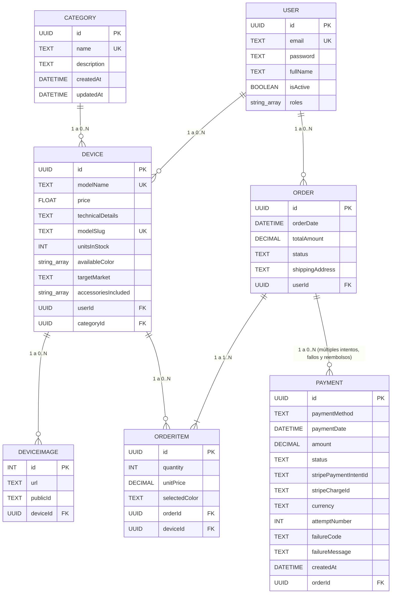
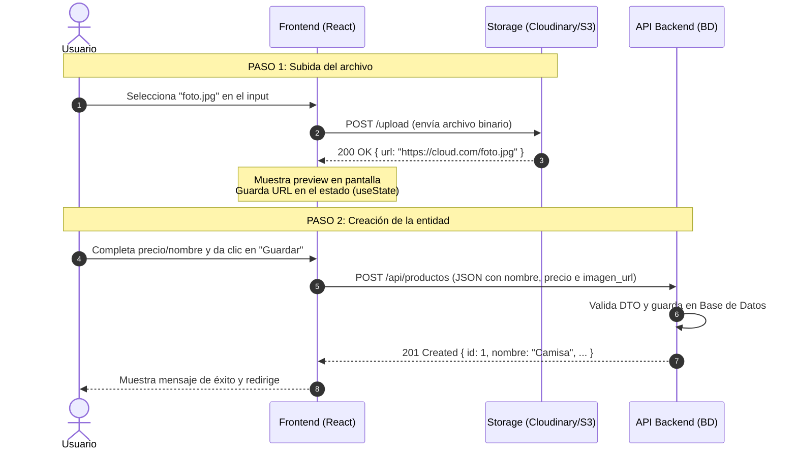

# Documentación del Proyecto y Arquitectura de Datos

## 1. Modelo Entidad-Relación (ERD)



---

## 2. Definición del Campo `targetMarket`

Define el segmento comercial o gama del dispositivo:

- **`budget` (Gama de entrada / Económico):** Productos accesibles, de bajo costo, enfocados en funciones básicas.
- **`mid-range` (Gama media):** Balance entre costo y rendimiento; buena calidad a precio moderado.
- **`premium` (Gama alta):** Productos de costo elevado, mejores materiales y características superiores.
- **`flagship` (Gama insignia / Top de línea):** El producto estrella de la marca; tecnología más avanzada de la categoría (ejemplo: Samsung Ultra, iPhone Pro Max).

---

## 3. Mapeo de Respuesta (Transformación de Imágenes)

Función para aplanar la relación de imágenes a un arreglo de URLs simples en la respuesta del Backend:

```javascript
return devices.map(({ images, ...product }) => ({
  ...product,
  images: images?.map((img) => img.url) ?? [],
}));
```

---

## 4. Diccionario de Atributos: PAYMENT

| Atributo                | Tipo      | Significado                                                                                                                                                               |
| ----------------------- | --------- | ------------------------------------------------------------------------------------------------------------------------------------------------------------------------- |
| `id`                    | UUID (PK) | Identificador único de esta fila/intento de pago en tu base de datos.                                                                                                     |
| `paymentMethod`         | TEXT      | Método usado para pagar (ej. `card`, `oxxo`, `transfer`, según lo que soporte Stripe en tu integración).                                                                  |
| `paymentDate`           | DATETIME  | Fecha y hora en que el pago se confirmó como exitoso. Queda vacío/null si el intento falló.                                                                               |
| `amount`                | DECIMAL   | Monto cobrado (o a cobrar) en este intento específico.                                                                                                                    |
| `status`                | TEXT      | Estado del intento: `pending`, `succeeded`, `failed`, `refunded`.                                                                                                         |
| `stripePaymentIntentId` | TEXT      | ID del `PaymentIntent` de Stripe (`pi_...`). Agrupa el proceso de cobro de una orden; puede repetirse en varias filas si reintentas confirmaciones sobre el mismo intent. |
| `stripeChargeId`        | TEXT      | ID del `Charge` de Stripe (`ch_...`). Es único por cada intento real de cobro, incluso si el `PaymentIntent` es el mismo.                                                 |
| `currency`              | TEXT      | Moneda del cobro (ej. `COP`, `USD`), en formato ISO 4217.                                                                                                                 |
| `attemptNumber`         | INT       | Número de intento para esa orden (1, 2, 3...), útil para mostrar historial sin contar filas.                                                                              |
| `failureCode`           | TEXT      | Código de error que devuelve Stripe cuando el pago falla (ej. `card_declined`, `insufficient_funds`, `expired_card`). Null si el pago fue exitoso.                        |
| `failureMessage`        | TEXT      | Mensaje legible para humanos que explica por qué falló el pago. Null si fue exitoso.                                                                                      |
| `createdAt`             | DATETIME  | Fecha y hora en que se creó el registro del intento, sin importar si tuvo éxito o no.                                                                                     |
| `orderId`               | UUID (FK) | Referencia a la orden a la que pertenece este intento de pago.                                                                                                            |

---

## 5. Diagrama de Secuencia: Carga Desacoplada de Archivos


